# Hopital_Spring_MVC_Partie1

## 🏥 Application Web de Gestion des Patients

## 📘 Activité Pratique N°3 - Spring MVC

Ce projet est une application Web basée sur **Spring Boot**, **Spring MVC**, **Spring Data JPA**, **Thymeleaf** et **H2**. Elle permet la gestion des patients avec plusieurs fonctionnalités utiles.

---

## ✅ Fonctionnalités

- 📄 Affichage de la liste des patients
- 🔎 Recherche dynamique par nom
- 🧮 Pagination des résultats
- 🗑️ Suppression d’un patient
- 🎨 Améliorations visuelles avec Bootstrap :
  - Couleurs conditionnelles
  - Icônes et tooltips
  - Boutons stylisés
  - Interface responsive et claire

---

## 🧱 Technologies utilisées

- Java 17+
- Spring Boot / Spring MVC / Spring Data JPA
- H2 Database (en mémoire)
- Thymeleaf
- Bootstrap 5.3.5
- HTML / CSS

---

## 🖼️ Captures d'écran

### 1️⃣ Affichage initial de la liste des patients

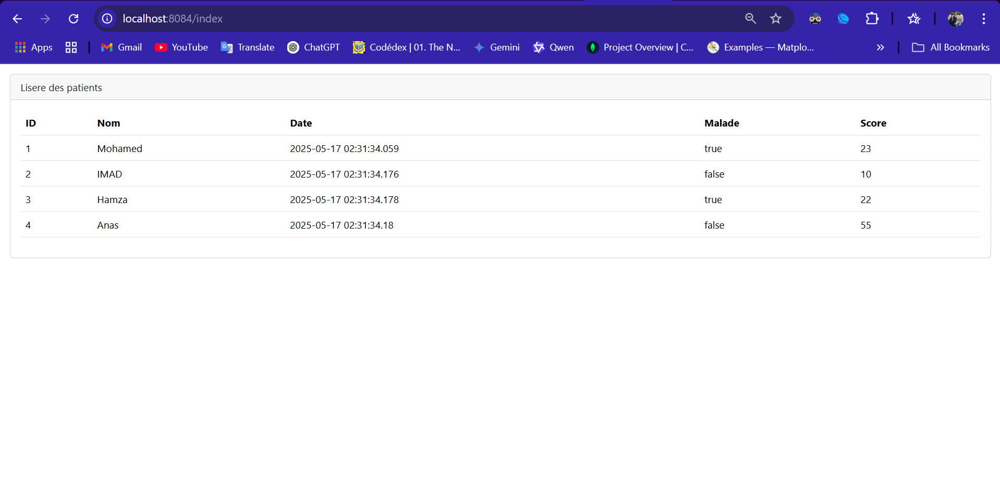

---

### 2️⃣ Console H2 - Contenu de la base de données

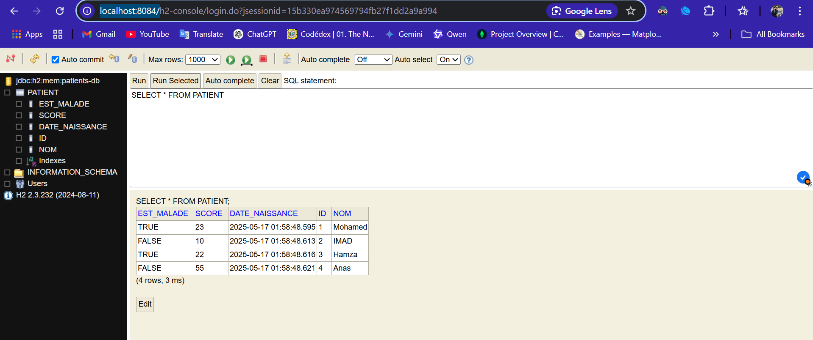

---

### 3️⃣ Exemple de pagination

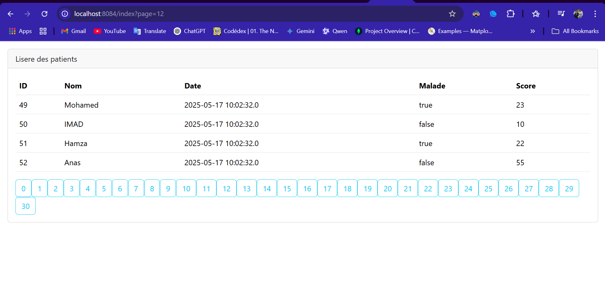

---

### 4️⃣ Une autre page paginée (page 9)

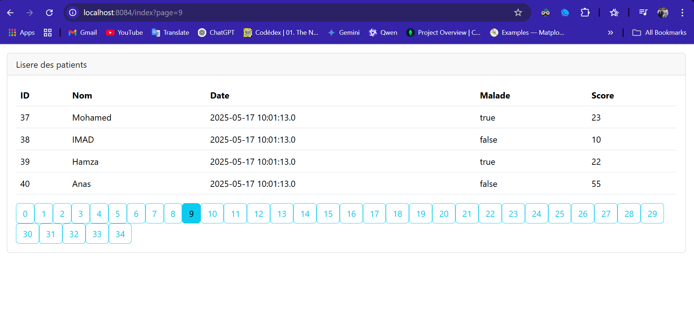

---

### 5️⃣ Résultat d'une recherche par nom "imad"

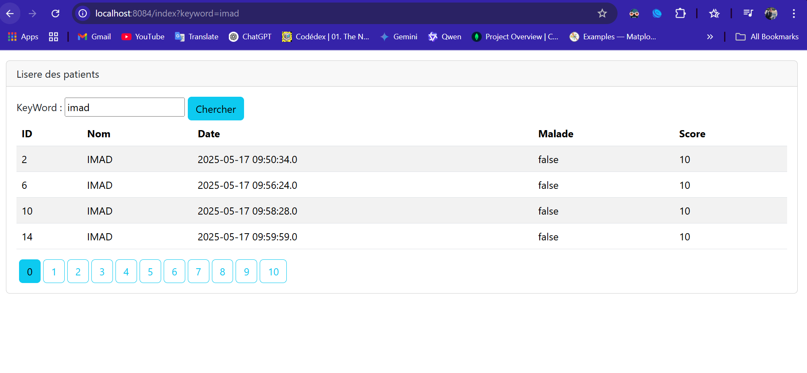

---

### 6️⃣ Résultat d'une recherche par lettre "A"

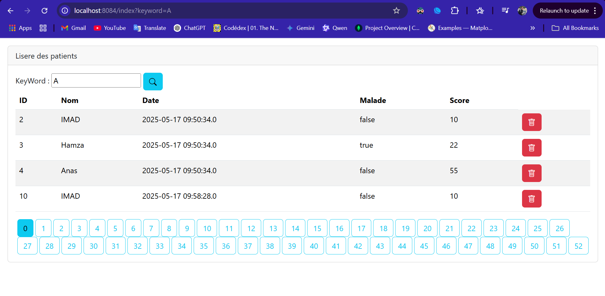

---

### 7️⃣ Résultat de la recherche avec pagination

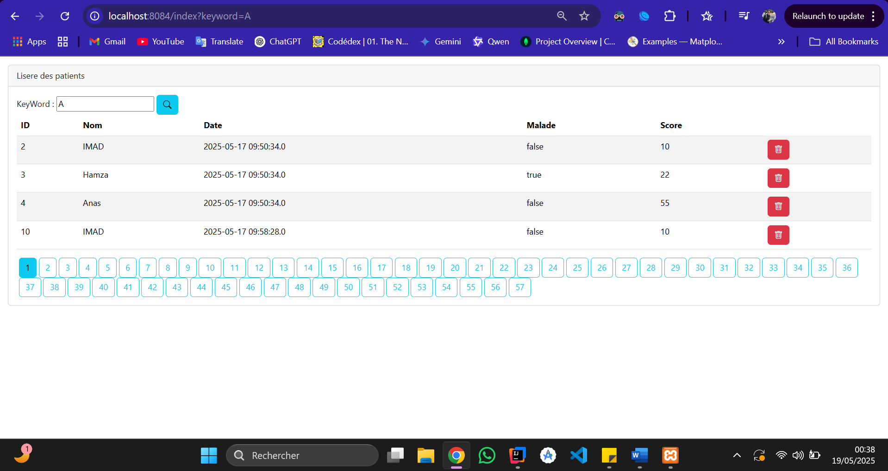

---

### 8️⃣ Version finale stylisée de l'interface

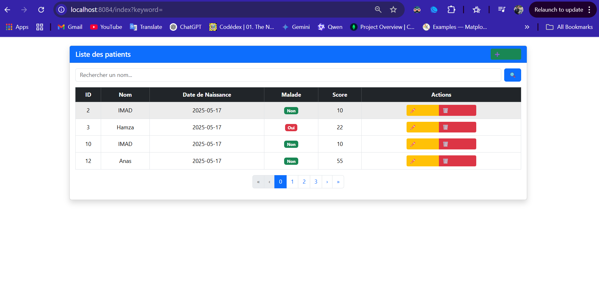

---

## ▶️ Lancer l'application

1. Cloner le projet dans ton IDE (IntelliJ recommandé)
2. Exécuter la classe `HopitalSpringMvcApplication`
3. Accéder à l’application via :  
   [http://localhost:8084/index](http://localhost:8084/index)

---

## 📂 Structure du projet

```bash
src/
├── main/
│   ├── java/
│   │   └── net.imad.hopital_spring_mvc/
│   │       ├── entities/Patient.java
│   │       ├── Repository/PatientRepository.java
│   │       └── web/PatientController.java
│   ├── resources/
│   │   ├── static/
│   │   │   └── captures/
│   │   │       ├── 1.png ... 8.png
│   │   └── templates/patients.html
│   └── application.properties
```
---

## 🔁 Partie 2 : Validation, Template et Navigation

👉 [📺 Vidéo Partie 2](https://www.youtube.com/watch?v=eoBE745lDE0)

Dans cette deuxième partie du projet, plusieurs améliorations fonctionnelles et visuelles ont été apportées :

- ✅ Création d’un fichier `template1.html` pour unifier l’en-tête et le pied de page
- ✅ Ajout de la validation des formulaires avec `@Valid` et `BindingResult`
- ✅ Affichage de messages de succès après modification ou ajout
- ✅ Maintien de la page courante et du mot-clé de recherche après édition
- ✅ Utilisation intelligente des couleurs Bootstrap :
  - 🔵 Recherche : `btn-primary`
  - 🟢 Ajouter : `btn-success`
  - 🟡 Modifier : `btn-warning`
  - 🔴 Supprimer : `btn-danger`
- ✅ Tooltips Bootstrap pour les boutons
- ✅ UI responsive, claire et professionnelle

---

## 🖼️ Nouvelles Captures d'écran (Partie 2)

### 9️⃣ Interface de modification avec retour vers la bonne page + message de succès


---

### 🔟 Formulaire de modification du patient

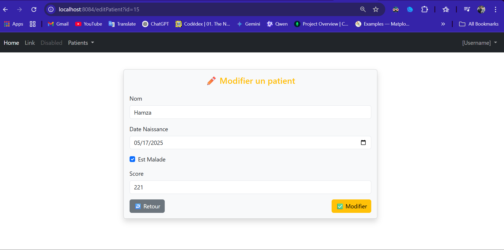

---

### 🔁 Formulaire d’ajout d’un nouveau patient

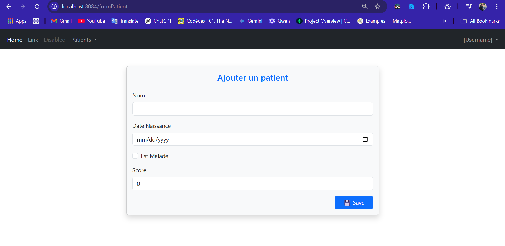

## 🔐 Partie 3 : Sécurité avec Spring Security

### Fonctionnalités sécurité :

- Formulaire login `/login`
- Redirection `/notAuthorized`
- Attribution dynamique via `app_user_roles`
- Encodage de mot de passe `BCryptPasswordEncoder`

### Captures Partie 3
- 
- 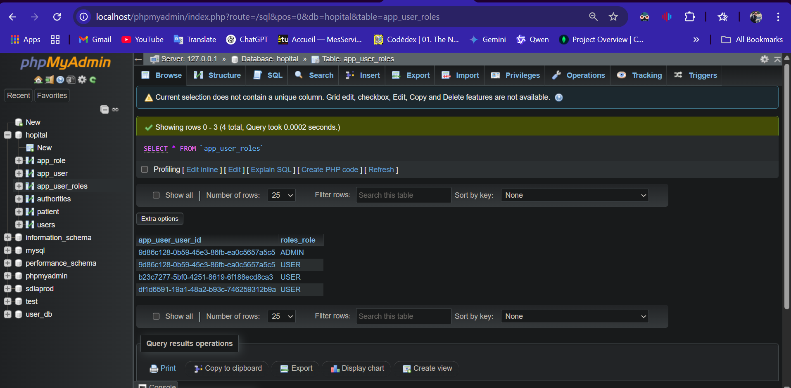

---


👤 Auteur
Projet réalisé dans le cadre de L'Activité Pratique N°3 - Spring MVC
Nom : IMAD EL KHELYFY

